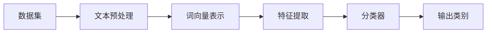

# 2.方面级情感分析相关理论方法

对方面级情感分析领域的研究经历了从基于传统机器学习方法到基于深度学习方法的发展，而当前主流的研究方法大多都是基于深度学习中预训练模型的方法。对于本文研究所涉及的方面级情感分析任务，将采用深度学习方法，在文本向量化的基础上，使用深度学习网络对评论文本进行多标签文本分类，识别出所提及的粗粒度评价维度，进而将该评价维度信息与评论文本基于注意力机制作交互，并与经过字词相似度加权构建的评论文本词向量进行特征融合，完成细粒度评论维度上的情感极性分类。

本章将首先介绍研究过程中所涉及的相关概念，包括对多标签文本分类任务和方面级情感分析任务的内容进行阐述。其次将介绍NLP领域文本向量化表示的常用方法，包括主流的Word2Vec模型和预训练的语言模型BERT。在此基础上，本章还将介绍在提取文本关联信息方面应用广泛的注意力机制，详细阐述其原理和计算方法。最后，本章还将对详细介绍深度学习方法中主要的特征提取器，包括循环神经网络、卷积神经网络和Transformer特征提取器。

## 2.1 相关概念

### 2.1.1 多标签文本分类

文本分类是NLP领域一个重要的研究方向，其主要目的是将文本划分为不同类别或分配不同标签。根据单个文本对应标签或类别数量的不同，文本分类又分为单标签文本分类和多标签文本分类。单个文本对应单个标签的任务称为单标签文本分类任务，而单个文本对应一个或多个标签的任务称为多标签文本分类任务。例如对一份新闻稿进行标签分类，因其内容可能由多则新闻构成，因此可能包含政治、体育、娱乐等多个标签，标签的数量至少为一个，属于多标签文本分类任务。

对于多标签文本分类任务，可将其表示为如下数学符号：记$D=\{(x_i,y_i)|1\leq i\leq m\}$为训练集中的一个样本，其中$m$为样本总数，假设在该训练集上训练得到模型$f:X\rightarrow Y$，其中$(X,Y)$为全部样本集，而$x_i$和$y_i$分别为样本集中的文本实例和对应的类别标签集合。则多标签文本分类任务可以表示为如下所示。

图中，训练集$X$包含了$m$个样本，标签集$Y$中的每一个$y_i$都是一个$l$维的0-1向量，$l$表示标签集中标签的数量，该表示方法相当于对标签集作了One-Hot编码。经由模型训练得到分类器$f$，将给定文本$x_i$输入分类器$f$中得到对应标签集$y_i$即可完成多标签文本分类。若考虑数据处理过程，则完整的多标签文本分类任务步骤如下所示。

### 2.1.2 方面级情感分析

情感分析是NLP领域文本分类方向下的一个分支任务，其主要任务是对给定文本中某一客观事物的主观情感信息进行挖掘，因此也称为观点挖掘。根据分析层次的不同，情感分析又衍生出粗粒度情感分析和细粒度情感分析两个方向。在粗粒度情感分析任务中，单个文本仅对应一个情感类别。而在细粒度情感分析任务中，根据任务目标的不同又可划分为两类：一类是在粗粒度情感分析的基础上将粗粒度的情感类别扩充为细粒度的情绪类别，例如“喜“、”怒“、”哀“、”乐“、”惧”等；另一类是为单个文本中提及的不同方面或维度下的情感划分类别，也称为方面级情感分析。例如，对评论“这辆车动力很足，底盘调教也不错，但变速箱有点顿挫，体验感不太好”而言，该条针对汽车的评论就包含了对动力、底盘和变速箱三个方面的评价，其中对动力和底盘的评价是积极的，而对变速箱的评价是消极的。根据文本中是否显式地提及方面项，方面级情感分析又可进一步划分为基于方面项的情感分析和基于方面类别的情感分析。由于餐饮消费在线评论文本不一定显式地包含方面项，因此本文研究所涉及的方面级情感分析任务属于后者。

假设评论文本所包含的方面类别或评价维度有$m$个，每个评价维度下又可划分为$s$个情感极性，则单个文本对应的情感类别实例可表示为如下矩阵，矩阵的每一列为单个评价维度下由One-Hot编码表示的情感极性。该矩阵表示，评论文本在Aspect-1方面下的情感类别为Sentiment-2，而在Aspect-2方面下的情感类别为Sentiment-1，在Aspect-m方面下的情感极性为Sentiment-s。

## 2.2 文本向量化表示

互联网的发展使得信息的获取更加便捷和多样化，利用网络可以轻松获取到大量的文本数据。海量的文本数据蕴含着许多值得深入挖掘的信息，在线文本数据量的几何式增长也推动了对非结构化文本信息挖掘相关研究方法的发展。对于人类而言，对自然语言的理解能力是从小耳濡目染慢慢形成的，而对于机器而言亦是如此。要使得计算机能够理解自然语言，就需要在大量的文本语料上进行训练，得到各种各样的语言模型。而作为这一过程中至关重要的第一步，便是要将以文本形式存在的自然语言，处理成计算机能够识别的数值形式，这便是文本向量化表示技术。

按照生成方式的不同，文本向量化表示方法可分为离散化方法和分布式方法。离散化方法主要包含One-Hot编码、TF-IDF编码、n-gram表示等；而分布式方法主要是将单词映射为高维空间中的词向量，当前主流的分布式文本向量化表示方法都是基于深度神经网络实现的，包括Word2Vec模型、BERT模型等，本文也主要介绍这两种文本向量化表示方法。

### 2.2.1 Word2Vec模型

稀疏性和维度过高是传统离散化表示方法存在的缺陷，而分布式表示方法词语能够将词语映射到自定义维度的高维空间中的一个稠密向量，相较于离散化向量表示，分布式的词向量能够包含更多的语义信息，而词语之间的语义相似度可以通过词向量在高维空间中的距离来反映。常见的分布式词向量模型是2013年Mikolov等提出的Word2Vec模型，其主要思想是利用语句中词与词之间存在上下文关联这一特点，构造神经网络完成词语预测词语的任务，属于一种无监督学习算法。根据预测方法的不同，又可将Word2Vec模型进一步分为CBOW（Continuous Bag Of Words）模型和Skip-Gram模型。

（1）CBOW模型

CBOW模型的思想是利用某个中心词的上下文预测中心词出现的概率，由此得到的词向量自然包含上下文的语义信息。在模型中，需要指定窗口宽度，在指定宽度内位于中间位置的词即为中心词，其余词属于上下文，CBOW模型任务就是基于极大似然估计方法，利用上下文输出词表中每个词出现在中心词位置的概率，将概率最大的词作为预测得到的中心词。CBOW的具体模型架构如图所示，图展示了窗口大小为2的情况下模型的计算过程，即w(t)作为待预测的中心词，其前后各两个词作为上下文输入模型。

记词表大小为$V$，窗口半径为$s$，则模型的输入由上下文的$V$维One-Hot编码向量构成，记为$X$，维度为$(2s,V)$。CBOW模型的第一步是对输入的One-Hot编码矩阵映射到指定维度，该维度一般远小于词表的大小，此处记为$k(k\ll V)$，则线性变换矩阵$W$的维度为$(V,k)$。而后对上下文映射到$k$维空间的向量进行加总，得到中间向量$H$，维度为$(1,k)$。为了使得模型能够输出词表中每个词出现在中间位置的概率，需要将$k$维向量再次映射为$V$维向量，变换矩阵为$W^\prime$，维度为$(k,V)$。不断迭代更新矩阵$W$和$W^\prime$，使得模型的交叉熵损失函数最小即为模型的最优解。其中，线性变换矩阵$W$即为在该语料上训练所得的$k$维词向量矩阵，第$i$行即为词表中第$i$个词对应的词向量。

（2）Skip-Gram模型

Skip-Gram模型的思想与CBOW模型相反，模型的输入是中心词，经过单层神经网络预测其上下文可能出现的单词，虽然预测方法不同，但模型得到的词向量同样包含了上下文的语义信息。Skip-Gram模型架构如图所示，图展示了窗口半径为2的情况下模型的计算过程，其中w(t)为中心词，作为模型输入预测其前后各两个单词。

与CBOW模型相同，训练模型的最终任务是得到线性变换矩阵。计算过程与CBOW模型计算过程类似，第一步先用$(V,k)$维度的变换矩阵$W$将输入矩阵映射为$k$维中间向量$H$，进而再利用$(k,V)$维度的变换矩阵$W^\prime$得到输出$V$维的预测结果，即每一个单词出现在上下文的概率。对上下文单词的预测结果与真实上下文单词计算交叉熵损失，迭代更新变换矩阵$W$直至损失函数达到最小，得到词向量矩阵$W$。

在模型最后一步得到一个$V$维向量后，需要对其作softmax归一化计算才能作为概率。一般情况下词表大小$V$是一个比较大的值，而softmax归一化中又涉及指数计算，因此在$V$很大的情况下模型的每一次输入都需要很高的计算复杂度，模型训练效率不高。为此，Mikolov等在Skip-Gram模型中提出了负采样（Negative Sampling）方法。负采样是一种提高数据集中负样本比例的方法，当负采样个数为$n$时，对于一个正样本就需要随机抽取$n$个负样本，达到$n+1$的样本量。应用到Skip-Gram模型中，在构造（中心词，上下文词）样本时，对于每一个正例样本，都从词表中随机抽取$n$个非上下文词与中心词构成负样本对，在最后softmax归一化时只在$n+1$维度上进行计算而不是词表维度$V$上，大大降低了模型计算的复杂度，提升了训练效率。

### 2.2.2 BERT模型

词向量模型训练时所使用的语料规模越大，得到的词向量包含的语义信息就越丰富。因此为了得到更为准确的词向量，一般会将模型在大规模语料上进行训练。但庞大的数据规模对模型训练所使用的计算机硬件水平也提出了更高的要求，时间成本也更高，对于个人研究者而言实现难度大。而机构研究者和大型互联网公司得益于自身优越的硬件资源，能够轻松将模型在大规模语料数据集上进行分布式训练，得到包含通用语义知识的预训练模型。对于个人研究者而言，只需要使用预训练模型的参数进行初始化，用小规模数据集对模型参数进行微调，便可在下游任务中获得不错的效果，这就是NLP领域进入预训练时代后常用的“预训练+微调”范式。

2018年，Devlin等提出了划时代的BERT（Bidirectional Encoder Representation from Transformers）模型，该模型主体架构由双向Transformer构成，经过在大规模语料上的预训练后，在下游11个NLP基准测试任务中达到了SOTA性能。传统的词向量模型如Word2Vec、Glove等均属于单向的语言模型，而BERT则采用了堆叠多层双向Transformer框架的方式作为特征提取器，构造双向语言模型，提高模型对文本语义信息的提取能力。

BERT模型的输入主要由三部分构成，分别是词嵌入向量（Token Embeddings）、语句分块向量（Segment Embeddings）和位置编码向量（Position Embeddings）。词嵌入向量为输入的每个单词的One-Hot编码向量，而语句分块向量则标志单词对应所在的语句，位置编码向量用于表示单词所在语句中的位置。此外，输入语句中还包含“[CLS]”和“[SEP]”两个特殊标识符，“[CLS]”标志多个语句是否连贯，而“[SEP]”则作为不同语句之间的分隔符。

BERT模型的预训练阶段主要有两个任务，分别是MLM（Masked Language Model）任务和NSP（Next Sentence Prediction）任务。MLM任务类似于完形填空，先按照事先制定的Mask策略对输入文本进行随机Mask操作，进而再利用上下文预测经过Mask操作的单词。具体地，Mask操作会将单词替换为“[MASK]”标识符，但该标识符仅在预训练阶段出现，下游任务中一般不会存在该标识符，会导致预训练阶段和微调阶段数据集存在偏差，因此不能简单地将单词替换为“[MASK]”标识符。因此Devlin等提出了如下Mask策略：①80%的概率替换为“[MASK]”标识符；②10%的概率替换为随机单词；③10%的概率保持不变。该策略也能够在一定程度上提升模型的鲁棒性。而对于NSP任务，其目的是判断多个语句是否连贯，也正因预训练阶段存在该任务，模型输入部分需要引入“[CLS]”标识符。加入NSP任务，能够提高模型在诸如智能问答、自然语言推理等下游任务上的适用性。

BERT模型的简易架构图如所示，特征提取层主要采用了双向Transformer框架，为了满足不同研究人员的需要，Devlin等发布了Base版本和Large版本两种预训练模型。其中，Base模型主要由12个Transformer编码器构成，而Large模型则包含24个，参数量达到了340M，为Base版本参数量的三倍多，但模型的效果比Base版本也要更好。

## 2.3 注意力机制概述

注意力机制（Attention Mechanism）最早是应用在计算机视觉领域，其含义是人类在认知的过程中由于大脑资源受限而选择性地关注部分信息而非全部信息。例如当观察一张图片时，人们总是更多关注图片中色彩更为鲜艳或主体更加突出的部分。在自然语言的理解上也存在类似的现象，即当阅读一段文字时，对文本中的关键词会赋予更多的关注，因此研究人员也将注意力机制引入到NLP领域，在机器翻译、智能问答等领域得到广泛应用。本节主要介绍注意力机制的原理和计算方法，在此基础上再对多头注意力机制的原理作介绍。

### 2.3.1 注意力机制

Attention机制本质上可以看作一种加权计算方法，假设存在查询向量$Q$、一组键向量$K$和一组值向量$V$，则Attention机制的操作过程便是将$Q$、$K$、$V$向量经过映射输出单个向量的过程。具体做法是对$Q$和每个$K$计算权重，利用该权重对每个$V$加权求和，得到最终的输出向量。

具体计算过程如式所示，对于查询向量$Q$，通过函数$softmax(a(Q,K_i))$得到基于查询向量与第$i$个键向量计算所得的权重，该权重可视为查询向量与键向量的相似度，也称为注意力分数（Attention Score）。利用该注意力分数对值向量$V_i$加权，得到基于Attention机制的输出向量。
$$
a_i=softmax(a(Q,K_i)) \\
Attention(Q,K_i,V_i)=a_iV_i
$$
式中，注意力评分函数$a$的选取可以有多种，本文主要介绍加性注意力（Additive Attention）和缩放点积注意力（Scaled Dot-Product Attention）两种计算方法。在加性注意力中，评分函数$a$的定义如式，该函数将查询向量和键向量输入到一个多层感知机中，并使用不带偏置项的tanh函数作为激活函数。而在缩放点积注意力中，评分函数$a$如式所示，其中$d_k$为键向量的维度，除以$\sqrt{d_k}$的操作便是对向量点积作缩放。
$$
a(Q,K)=tanh(QW_q+KW_k)W_v
$$

$$
a(Q,K)=\frac{QK^T}{\sqrt{d_k}}
$$

### 2.3.2 多头注意力机制

多头注意力（Multi-head Attention）机制属于注意力机制的一类，但多头注意力并不直接对查询向量和键值对向量直接计算，而是先将$Q$、$K$和$V$作线性变换，如式所示，对线性变换后的查询矩阵和键值对矩阵作注意力分数的计算，将这两个步骤同时进行$h$次，并将得到的结果作拼接，得到基于多头注意力机制的输出向量。

多头注意力机制的具体计算过程如下：
$$
MultiHead(Q,K,V)=Concat(head_1,head_2,\cdots,head_h)W^O \\
head_i=Attention(QW_i^Q,KW_i^K,VW_i^V)
$$
其中，$W_i^Q$、$W_i^K$是维度为$(d_{model},d_k)$的线性变换矩阵，而$W_i^V$是维度为$(d_{model},d_v)$的变换矩阵，$d_{model}$为模型输入的向量维度。经过$h$次注意力计算后，将多个注意力计算结果进行拼接，并利用维度为$(h\times d_v,d_{model})$的变换矩阵将其映射为与输入向量相同维度的输出向量。为保证维度的一致性，需要满足以下条件：$d_k=d_v=d_{model}/h$。

由上述计算过程可以发现，多头注意力机制本质是进行多次独立的注意力计算，最终将多次计算结果集成到一个向量中，每个head中的注意力计算仅对输出序列中的单个子空间产生影响。因此，相比于单头注意力（Single-head Attention）机制，多头注意力机制能够在一定程度上防止过拟合。

## 2.4 特征提取器

传统的机器学习方法需要人工进行复杂的特征工程，才能在任务中取得不错的效果。而深度学习方法得益于丰富的网络拓扑结构，能够自动提取相关特征，相比传统机器学习方法效率更高。当前NLP领域所采用的深度学习研究方法中，循环神经网络、卷积神经网络和Transformer架构是常用的三大特征提取器。本文研究在粗粒度评价维度识别任务种使用的模型所采用的特征提取器就包含了前两种，而在方面级情感分析任务中用到的预训练模型在特征提取层使用了Transformer，因此本节将对这三种特征提取器作详细介绍。

### 2.4.1 循环神经网络

循环神经网络（Recurrent Neural Network, RNN）是深度学习领域中广泛使用的特征提取器之一，主要应用在序列数据建模领域。在自然语言中，上下文之间是存在关联性的，即当前位置的词与上一个词和下一个词存在相关性或依赖性。简单结构的神经网络并不能对词语之间的关联信息进行建模，在处理长文本的过程中也无法将前面的语义信息有效传递给后续的处理，即普通的神经网络不具备记忆功能。而RNN能够将上一时刻隐藏层的输出和当前时刻的输入同时传递到当前时刻的网络单元中，独有的网络结构使其天然具备时序建模的优势，因此RNN在NLP领域也得到了广泛应用。

根据输出层序列长度的不同，RNN又可分为“N vs N”、“N vs M”、“N vs 1”和“1 vs N”四类。其中，输入和输出序列长度相同的网络属于“N vs N”类RNN，适用于部分机器翻译应用场景；而对于“N vs M”和“1 vs N”类型的RNN则适用于智能问答、图片转文字等文本生成类场景；输出层仅为单个值的网络属于“N vs 1”类RNN，其主要对最后一个时间步输出的隐藏层向量作线性变换后再输入到分类器中给得到单个计算结果，适用于文本分类场景。

图展示了“N vs N”类RNN的结构，此处假设文本包含四个单词，每一个时间步的输入$x_t$都有两部分构成，分别是上一时刻隐藏层的输出$h_{t-1}$和当前时刻的单词$w_t$。而对于初始时刻$t=1$，其隐藏层单元尚未有计算结果，因此需要指定一个初始化的隐藏层输出$h_{init}$代替。网络中每一个输入都对应一个输出，因此输入输出序列是等长的。

理论上RNN能够处理任何序列长度的时序数据，而实际应用过程中，RNN在长序列建模时容易出现梯度消失和梯度爆炸问题。因为在反向传播的过程中，当前时刻$t$的梯度包含了所有后续梯度的乘积，在$t$比较小的情况下，若后续梯度很小则会发生梯度消失，而后续梯度很大又会造成梯度爆炸。长短期记忆网络（Long Short-Term Memory, LSTM）的提出正是为了缓解RNN在处理长序列时存在的问题，其在RNN的基础上引入了细胞状态和门控机制，提出了输入门、遗忘门和更新门，实验也证明了加入门控机制的LSTM模型能够在长序列建模上比普通的RNN效果更好。

图展示了LSTM网络中单个时间步的处理过程，其中$c_t$表示$t$时刻的细胞状态，$\tilde{c_t}$表示$t$时刻的候选细胞状态，而$f_t$、$i_t$和$o_t$分别表示遗忘门、输入门和输出门的值。遗忘门决定何时丢弃上一时刻细胞状态所传递的部分信息，这在时序较长时能够有效避免冗余信息的传递；输入门决定何时加入候选细胞状态的信息，即何时将新的信息往后传递；输出门负责将细胞状态转为隐藏层输出。具体计算方式如下：
$$
f_t=\sigma(W_f\cdot[h_{t-1},x_t]+b_f) \\
i_t=\sigma(W_i\cdot[h_{t-1},x_t]+b_i) \\
\tilde{c_t}=tanh(W_c[h_{t-1},x_t]+b_c) \\
o_t=\sigma(W_o\cdot[h_{t-1},x_t]+b_o) \\
c_t=f_t\cdot c_{t-1}+i_t\cdot \tilde{c_t} \\
h_t=o_t\cdot tanh(c_t)
$$
三种门控机制各司其职，使得LSTM模型既能够提取当前状态的信息，又能够对过去时刻的历史信息进行有效传递。LSTM模型的这种特性表现在NLP领域便是其能够很好地对语句的时序信息进行建模，因为在自然语言中，语句的前后部分通常是存在一定关联的，而LSTM模型的记忆功能能够捕捉到上下文之间的关联信息，并将前文的有效信息传递给后文。

### 2.4.2 卷积神经网络

卷积神经网络（Convolution Neural Network, CNN）也是深度学习领域常用的特征提取器之一，CNN最早是应用在计算机视觉领域，其模仿人类观察图片的方式，使用卷积操作在图片上搜索低层次到高层次的特征，完成图片的自动化识别。而随后研究人员也将CNN引入到了NLP领域，并在文本分类、语义解析、情感分析等NLP任务上取得不错的效果。

CNN主要由卷积层、池化层和全连接层构成，卷积层通过卷积核的滑动提取图片的局部特征，池化层负责对卷积操作提取到的特征进行降维处理，而全连接层负责将特征进行加权后输入分类器中。在文本分类领域，应用较广泛的CNN模型是2014年Kim提出的textCNN模型，该模型的主要思想是利用多个不同维度的卷积核提取文本的局部信息，完成文本分类任务。textCNN的模型架构如图所示。

假设$X$为输入文本，维度为$(n,k)$，其中$n$为句子长度，$k$为词向量维度。CNN的卷积操作本质上是一种基于卷积核的映射过程，即利用参数矩阵将局部信息映射为单个值。在文本分类任务中，卷积操作是在句子长度维度上进行的，卷积核的宽度与词向量的维度保持一致，而高度则作为模型的超参数，因此卷积操作后得到的将是一个列向量。记卷积核的高度为$f$，滑动步长记为$s$，则卷积操作后得到的向量维度计算公式为：
$$
d=\frac{n-f}{s}+1
$$
利用卷积核提取文本的局部信息得到特征向量后，将其输入到池化层中进行降维操作。根据计算方法的不同，一般可分为以下几种池化方法：①最大池化（Max Pooling），对每一种卷积核生成的特征向量取最大值；②平均池化（Average Pooling），对每个特征向量取平均值；③Top-K池化（Top-K Pooling），对每个特征向量取前k个最大值；④Chunk-Max池化（Chunk-Max Pooling），对特征向量分块后取每块中的最大值进行拼接作为池化结果。池化层能够将特征向量进行压缩，进一步提取关键的特征信息，简化后续的计算量。

### 2.4.3 Transformer

Transformer是当前预训练模型中最常用的特征提取器之一，BERT、GPT等大型预训练语言模型都是基于Transformer框架构建的，在多种NLP任务中也取得了很好的效果。Transformer框架主要利用了多头注意力机制，其模型主要由堆叠的N个编码器和N个解码器两部分构成，模型架构如图所示。

如图所示，左边部分为Transformer的编码器，右边部分为解码器。这种架构使得Transformer既可以适用于文本分类任务，也可以使用与文本生成任务。在分类任务中，只需要用到Transformer的编码器部分即可，在BERT、ERNIE等预训练模型中亦是如此，因此本文着重介绍编码器部分的计算过程。

Transformer的输入部分由两部分构成，分别是词向量和位置编码向量。其中，词向量可以是由Word2Vec、Glove等词向量模型生成的预训练词向量，而位置编码向量则通过模型指定的位置编码函数将位置信息转换为嵌入向量。将词向量和位置编码向量对位相加，得到包含文本语义信息和位置信息的输入向量。而在编码器部分，Transformer主要包含两个模块，分别是多头注意力模块和前馈神经网络模块。Transformer中的多头注意力是基于自注意力（Self-Attention）机制实现的，普通的注意力机制需要确定$Q$、$K$和$V$三个向量，而自注意力机制中三个向量都来自输入向量，即$Q=K=V$。通过多头的自注意力机制使得编码器在对单个词语编码时能够关注到语句中其余单词的信息，充分提取句子中的上下文特征。而前馈神经网络层则负责对经过多头注意力机制的输出特征作线性变换，将特征映射到下游需要的维度上。

此外，由图可以看到，编码器的每个子模块之后都紧随“Add & Norm”操作，其含义是残差连接和归一化操作。在Transformer框架中，其通过堆叠多个编码器构造深度神经网络提高模型的拟合效果，但过深的网络容易导致梯度消失等网络退化问题，而残差连接正是为了解决这一弊端而引入到模型中的。其次，归一化操作主要对每层的输入作归一化运算，防止因数值过大或过小而影响损失函数的收敛，保证模型训练的稳定性。

## 2.5 小结

本章主要对本文研究中方面级情感分析领域所涉及的相关概念和理论方法作了详细阐述。本文研究在粗粒度评价维度识别任务的基础上进一步完成方面级情感分析任务，因此本章首先介绍了多标签文本分类和方面级情感分析的概念和分类。在此基础上对情感分析任务中的第一步——文本向量化表示相关的研究方法作了介绍，主要包括传统的词向量模型Word2Vec和基于大规模语料的预训练模型BERT。进一步又介绍了在文本关联信息提取方面应用广泛的注意力机制，对其原理和计算方法作了详细描述。在本章最后部分还介绍了情感分析任务中常用的三种特征提取器——RNN、CNN和Transformer，对每种特征提取器的原理和框架都作了详细论述。