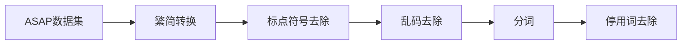

# 3. 在线评论文本预处理

模型的训练需要基于数值计算，而文字构成的语料并不能直接作为模型的输入，因此还需要经过一系列的预处理并将文本映射到高维向量空间后，才能作为模型的输入。本章节为数据预处理部分，为后续模型训练提供数据支持。本章节将首先介绍数据来源，简要描述数据采集过程中的相关细节，进而对该数据集进行清洗，最后基于Word2Vec模型对预处理后的语料进行词向量的预训练，并从词汇语义相似度方面考察了词向量模型的训练效果。

## 3.1 数据说明

### 3.1.1 ASAP数据集概述

本文研究所采用的是美团在2021年4月开源的数据集ASAP。该数据集收录了来自美团旗下”大众点评“平台上的46730条用户餐饮消费在线评论文本（其中包括训练集36850条，验证集4940条，测试集4940条），是当前方面级别情感分析领域规模最大且质量相对较高的中文数据集。由于该数据集是专门针对基于方面类别的情感分析任务所提出的，数据集中预先定义了18个细粒度的评价维度，每个评价维度下又可划分出消极、中性、积极和未提及4种情感极性。为保证数据集的质量，在采集过程中遵循了以下原则：①剔除少于50个字符的短文本和多于1000个字符的冗长文本；②剔除非中文字符占比超过70%的文本；③采用基于BERT的分类模型识别广告文本并予以剔除。而在标注过程中，美团采用了多轮标注和交叉比对的方法尽可能降低人工标注的主观性，提高标注的准确性。ASAP数据集的高质量，保证了其能够为后续模型的训练和优化提高坚实的数据支撑。数据集的字段说明及样例见表。

### 3.1.2 ASAP数据集可视化

对数据集中18个评价维度作统计分析得到图，可以看出，评论文本中涉及维度最多的是菜品的口味（Food#Taste），其次是服务的态度（Service#Hospitality）和价格水平（Price#Level）。

对评论文本的长度作统计分析得到图，可以看出，60%左右的评论文本长度在100~300个字符之间，总体上看将近90%的评论文本长度都在500个字符以内，该分析结果能够为后续模型训练中文本长度参数的设置提供一定的参考价值。

## 3.2 数据预处理

数据集中的评论文本来源于线上平台的网络文本，因此需要对其进行一定步骤的预处理。本文主要对数据集做了如下清洗：

### 3.2.1 繁简转换

由于数据集来源于网络文本，不同用户有不同的输入法使用偏好，有的用户习惯使用繁体字输入法发表评论，因此数据集中存在着简体和繁体两种不同的中文字体。而从语义表示的角度上看，简体和繁体仅仅是书写方式的区别，其表达的语义信息是相同的。如果不对其作统一处理，则后续词向量的训练会出现冗余向量，即存在相同语义信息的不同向量表示，同时也会增大模型训练的时空复杂度，因此有必要对数据集中的简体字和繁体字进行统一表示。本文采用的处理方法是将繁体字转换为简体字，使用的是Python中的zhconv模块。

### 3.2.2 标点符号处理

出于语言表达的习惯，标点符号常用于作为语句划分标识。不同于正式的书面语言，网络文本中标点符号的使用相对较为随意，例如多个句号并排可能表示”无奈“的语气，亦或只是用户误输入了多个符号，实际语义信息并不明确。为了后续词向量训练的准确性，本文研究过程中统一对标点符号进行了剔除。

### 3.2.3 乱码处理

网络文本不可避免会存在Unicode乱码，而乱码是不具备任何语义信息的Unicode码，若不进行剔除，在词向量训练阶段模型会误将该乱码视为单个分词并赋予语义表征向量。因此，本文在数据预处理阶段对以下可能出现的乱码做了剔除，分别是\u0020（普通半角空格）、\u3000（普通全角空格）、\u00A0（html实体不间断空格）、\xa0（十六进制html空格）、\u2002（html实体半角空格）、\u2003（实体全角空格）等。

### 3.2.4 分词

经过上述步骤的清洗后，还需要对评论文本进行分词，以便后续词向量模型的训练。分词工具方面，本文选取的是Python的jieba中文分词库，其分词原理大致如下：首先基于自带的默认词典构建前缀词典，进而根据输入文本扫描前缀词典的结果构建有向无环图（DAG），最后基于动态规划在DAG中寻找概率最大的路径得到分词结果。jieba的默认词典属于通用领域词典，而本文研究所采用的数据集来源于餐饮消费领域，为了提高分词的准确性，本文在分词阶段采用了搜狗网络词库中”饮食“类目下的多个词库对jieba库的默认词典进行了扩充，扩充前后分词效果比较见表。

| 原始文本                                         | 词典扩充前分词结果                                           | 词典扩充后分词结果                                        |
| ------------------------------------------------ | ------------------------------------------------------------ | --------------------------------------------------------- |
| 他家的冰糖乳鸽燕窝羹非常值得推荐，松鼠鱼也很新鲜 | 他家 的 冰糖 乳鸽 燕窝 羹 非常 值得 推荐 ， 松鼠 鱼 也很 新鲜 | 他家 的 冰糖乳鸽燕窝羹 非常 值得 推荐 ， 松鼠鱼 也很 新鲜 |

### 3.2.5 停用词去除

由于中文表达的习惯，评论文本中含有大量的”的“、”地“、”得“等虚词，也称为停用词（Stop Words）。在词向量训练时，无需关注这一部分词语，因此可以在预处理阶段对停用词进行剔除。本文综合了目前开源的多个停用词表，包括中文停用词表、百度停用词表、哈工大停用词表和四川大学机器只能实验室停用词库等，整合成为新的停用词表，尽可能完整地去除数据集中的停用词。

## 3.3 词向量训练

由于NLP领域中的语料大多都属于未标注数据，人工标注的语料往往不宜获得，因此当前主流的词向量训练方法便是采用适用于无监督学习的词向量模型对未标注语料作预训练，而Word2Vec模型在词向量训练领域已经得到广泛应用，模型较为成熟，因此本文选取该模型作为词向量模型进行训练。

经过上述步骤的预处理后，得到的是分词后的ASAP数据集，数据集的基本情况如表所示。由于本文研究的领域为餐饮消费领域，仅仅采用了ASAP数据集作为词向量训练语料，后续再根据具体的任务对词向量作微调，该做法能够使得模型学到的语义向量领域适用性更强。

| 评论数（条） | 语料大小（GB） | 总词汇量（万） | 词表大小（万） |
| ------------ | -------------- | -------------- | -------------- |
| 36850        | 0.11           | 390.5149       | 12.7415        |

### 3.3.1 模型参数

工具方面，Python的第三方开源库gensim包含了Word2Vec子模块，该模块内置了CBOW模型和Skip-Gram模型，本文选取的是Word2Vec模型的CBOW模式对词向量作预训练，模型的输入是经过分词的评论文本，CBOW模式下gensim库会自动划分出窗口内的中心词和上下文，构造出训练集和对应标签，调用时只需要设置好相应的参数即可。

模型训练过程中，相关参数设置如下：①参数size用于设置模型输出词向量的维度，若维度过低，则词向量无法完整地包含词语的语义信息，而维度过高又会增加后续模型训练的时空复杂度。本文该阶段获得的词向量将会用于后续模型输入的初始化词向量，因此词向量的维度应当与后续模型设置相对应，此处size设置为768；②参数window用于设置当前词与目标预测词之间的最大距离，若采用CBOW模型，则目标预测词即为滑动窗口内的中心词，而window相当于滑动窗口的半径。此处保持仍模型默认的设置，window为5；③参数min_count用于设置单词最少出现次数，出现频率低于min_count的单词将会被丢弃，该操作会减小最终训练所得词表大小。由于本文在评论文本预处理阶段已经将乱码和停用词进行了清洗，在词向量预训练阶段不再对词表的筛选作过多的限制，min_count设置为1；④参数iter设置模型迭代次数，经过多次实验比较词向量训练效果，模型迭代10次时效果相对较好；⑤参数alpha和min_alpha是对学习率衰减策略的设置，alpha设置为0.025，min_alpha设置为0.0001，则训练过程中学习率会从0.025线性下降为0.0001；⑥参数negative设置负采样的个数，采用默认设置5。

### 3.3.2 训练效果

将分词后的训练集语料作为模型的输入，经过10次迭代训练后，得到127415个词向量。此外，还需要增加两个特殊的词向量，分别代表“[PAD]”和“[UNK]”。其中，“[PAD]”主要作为后续模型训练时将评论文本补齐到统一固定长度所采用的标识符，而”[UNK]“主要是对样本外数据集进行预测时用于表示未登录词的标识符。在词向量的预训练阶段，本文对这两个特殊标识符赋予了分别赋予了0向量，后续可以根据具体任务参与微调。

在传统语法规则中，词汇语义相近或相同的词语称为近义词，而在词汇经过词向量模型映射为高维空间向量后，词汇之间语义的近似程度理论上表现为词向量之间的距离，语义信息越接近则两个词向量应当距离越近。Word2Vec模型提供了不同词汇之间基于余弦相似度的计算，同时可以查询与某个词汇相似度最高的前k个词。此处以词语”薯条“为例，与”薯条”该词的词向量最为接近的Top-10个词向量如表所示。

| 词语     | 相似度             |
| -------- | ------------------ |
| “鸡米花” | 0.852243959903717  |
| “薯角”   | 0.7987374067306519 |
| “薯格”   | 0.7732587456703186 |
| “粗薯”   | 0.7457643747329712 |
| “番茄酱" | 0.7324262857437134 |
| ”炸薯条“ | 0.7253045439720154 |
| ”汉堡“   | 0.6886316537857056 |
| ”炸鸡块“ | 0.6879271268844604 |
| ”薯饼“   | 0.6708752512931824 |
| ”炸鸡“   | 0.6634553074836731 |

可以看出，与”薯条“最相似的前十个词向量均为快餐店的食品，而”薯条“本身也是出现在快餐店居多，该组词语所代表的食品与“薯条”是快餐店经常出现的搭配，因而与“薯条”出现在同一条评论中的可能性也较大，而”番茄酱“作为”薯条“的蘸料也排在了前5的位置，从直观上判断该组词汇与目标词汇之间确实存在较强的语义关联，这也表明基于ASAP数据集的语料学到的信息能够较好地反映词汇之间的语义相似性，词向量模型的训练效果较好。

CBOW模式下的Word2Vec模型基于未标注的语料进行无监督学习，利用滑动窗口内的上下文对中心词进行预测，其前提假设是上下文与中心词之间存在关联性，这也符合日常语言表达的语法习惯，因此模型能够充分学习到语料中包含的语义信息，为后续其他任务模型的训练提供更好的初始化向量。

